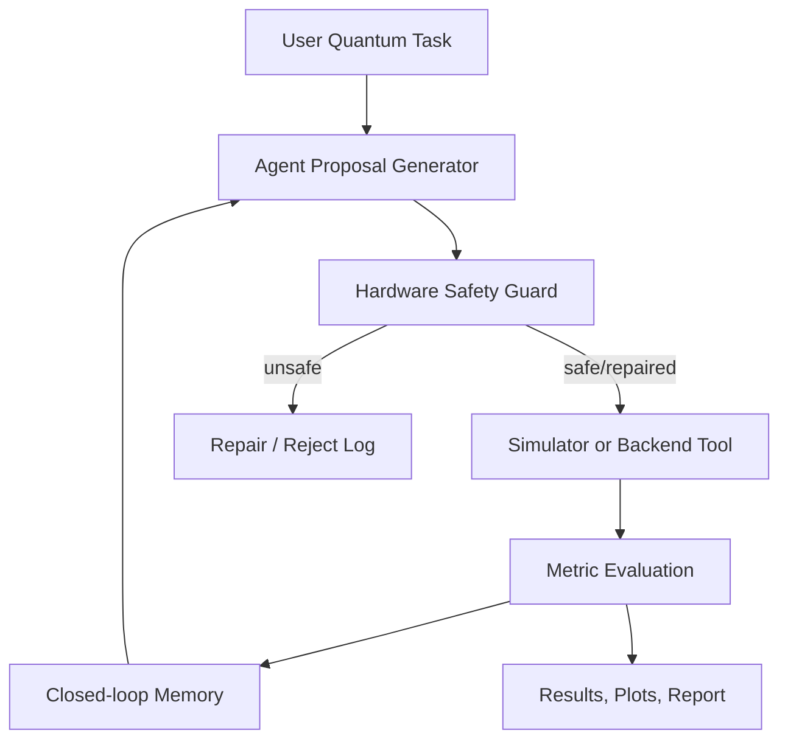

# Architecture Diagram

```mermaid
flowchart TD
    A[User Quantum Task] --> B[Agent Proposal Generator]
    B --> C[Hardware Safety Guard]
    C -->|safe/repaired| D[Simulator or Backend Tool]
    C -->|unsafe| E[Repair / Reject Log]
    D --> F[Metric Evaluation]
    F --> G[Closed-loop Memory]
    G --> B
    F --> H[Results, Plots, Report]
```
